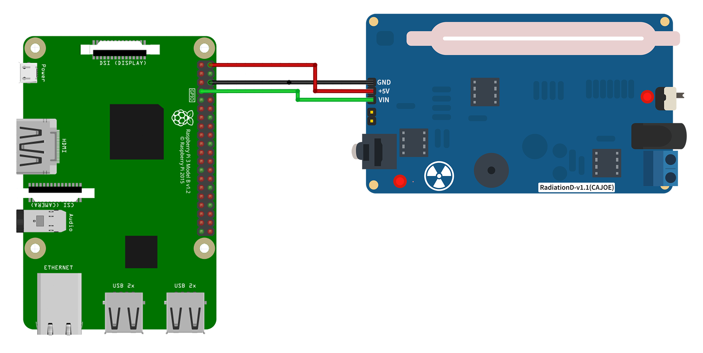

# Τύχη: Zufall durch Zerfall

Dieses Repository stellt den Quellcode des Jugend forscht 2026 Projekts von Piro B. und Benedikt M. zur Verfügung.

## Nutzen

Es wurde ein Zufallszahlengenerator gebaut, der die Zeitintervalle zwischen radioaktiven Impulsen in unverschobene Zufallsinformation in Form von Bits umwandelt, auf welche man dann über einen HTTP-Server zugreifen kann.

## Verwendung
Der Quellcode dieses Projekts ist hauptsächlich in `server/src/I2B.h` zu finden. `server/src/server.cpp` beinhält einen HTTP-Server, mit
welchem man Bytes abfragen kann. Der server kann durch `sudo make run` in dem `server` Verzeichnis auf einem Raspberry Pi gestartet werden
kann.

`include/` enthält C++-Bibliotheken.

## Hardware
## Benötigte Hardware

+ Rasberry Pi 3 oder 4
+ SD Karte für den Rasberry Pi
+ Stromversorgung
+ Ein Geigerzähler DIY-Kit([Empfohlen](https://www.aliexpress.com/p/tesla-landing/index.html?scenario=c_ppc_item_bridge&productId=1005009184777906&_immersiveMode=true&withMainCard=true&src=google&aff_platform=true&isdl=y&src=google&albch=shopping&acnt=272-267-0231&isdl=y&slnk=&plac=&mtctp=&albbt=Google_7_shopping&aff_platform=google&aff_short_key=UneMJZVf&gclsrc=aw.ds&&albagn=888888&&ds_e_adid=&ds_e_matchtype=&ds_e_device=c&ds_e_network=x&ds_e_product_group_id=&ds_e_product_id=de1005009184777906&ds_e_product_merchant_id=705499124&ds_e_product_country=DE&ds_e_product_language=de&ds_e_product_channel=online&ds_e_product_store_id=&ds_url_v=2&albcp=20542208798&albag=&isSmbAutoCall=false&needSmbHouyi=false&gad_source=1&gad_campaignid=19235627476&gbraid=0AAAAAoukdWM_jnEs7dPEDA_gI9XJt04lS&gclid=Cj0KCQjwgpzIBhCOARIsABZm7vH7AkAiBMvRMQgKzhqbP8R50F9lGAVXU0K-is7Sg-hTWIZsobKQ3dEaAopqEALw_wcB))
+ Drei Female to Female Jumper Kabel
### Verkabelung

Es gibt drei Verbindungen, die wir von der Strahlungsdetektor-Platine zum Raspberry Pi herstellen müssen: +5 V und Masse (GND) zur Stromversorgung sowie die Ausgangs-Impulsleitung zur Zählung der Ereignisse. Beachte, dass diese Leitung als **VIN** bezeichnet wird – was etwas verwirrend sein kann, da „VIN“ normalerweise „Spannungseingang“ oder etwas Ähnliches bedeutet. Auf dieser Platine ist es jedoch der Ausgang.

In dieser Konfiguration musst du nur **eine** der beiden Platinen mit 5 Volt versorgen. Wenn du den Raspberry Pi mit einem normalen **Micro-USB-Netzteil** betreibst, wird die **Detektor-Platine über die hergestellten Verbindungen automatisch mitversorgt**.

## Anhänge
+ Bild und Text inspiriert durch [GitHub Link](https://github.com/chrisys/background-radiation-monitor/blob/master/README.md).
>

